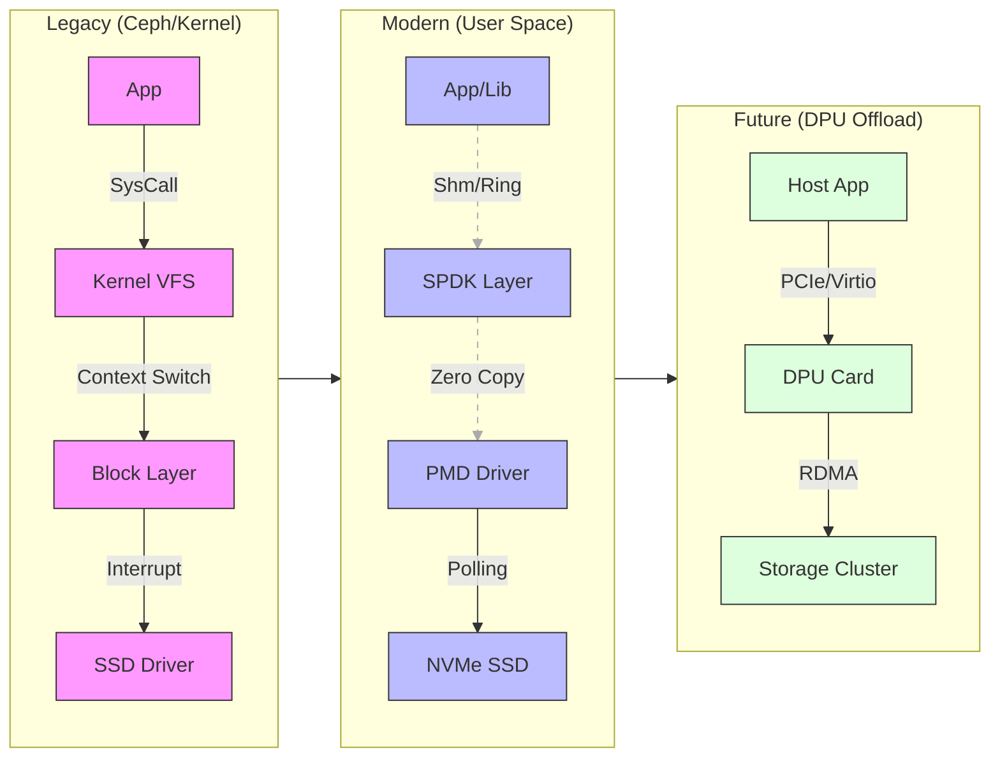

# 网络存储开发相关总结

## 云厂商网络存储解决方案演化
### 演进的本质逻辑
CPU 在 I/O 处理中的税太高，需要把数据的搬运工从“昂贵的通用 CPU + 笨重的内核” 逐步迁移到 “廉价的专用硬件 + 极简的用户态逻辑”。

### 整体框架进化三阶段
#### 阶段一：标准协议 + 开源魔改（Ceph/Kernel 时代）

- **架构特征：** 依赖 Linux VFS、Page Cache、TCP/IP 协议栈。
- **本质局限：** **“内核墙” (The Kernel Wall)**。
  - **中断风暴：** NVMe SSD 的 IOPS 到了百万级，每秒百万次的中断（Interrupt）让 CPU 不堪重负。
  - **上下文切换：** 数据从用户态 -> 内核态 -> 用户态，这就好比送快递每过一个路口都要填一遍表格，延迟都在这些“填表”时间（System Call overhead）上。
  - **锁竞争：** 传统文件系统的锁机制无法适应多核并发。
- **结论：** 这一阶段我们是在**“带着脚镣跳舞”**，软件栈成为了瓶颈。解决“有无”和“兼容”问题。 我们早期采用了标准的 iSCSI/Ceph 方案。它的优势是兼容性好、上线快。但随着 SSD 介质从 SATA 转为 NVMe，我们发现瓶颈不在硬盘，而在内核。一次 I/O 请求，内核态的指令周期甚至超过了硬件介质本身的延迟，中断开销和上下文切换成为了不可忽视的“税”。

#### 阶段二：用户态 + 全自研引擎（SPDK/User Space 时代）

- **架构特征：** **OS Bypass (绕过内核)**。引入 SPDK/DPDK，自研存储引擎。
- **技术杀手锏：**
  - **Polling (轮询) 替代 中断：** 既然数据来得这么快，我就不睡觉（挂起）了，一直盯着（轮询），消除了上下文切换开销。
  - **Zero-Copy (零拷贝)：** 数据直接从网卡 DMA 到内存，再 DMA 到 SSD，CPU 只负责指挥，不沾手数据搬运。
  - **Lock-Free (无锁编程)：** 每个 Core 绑定专用的 I/O 队列（Shard-nothing 架构），彻底消除锁竞争。
- **收益：** 用 100% 的 CPU 跑满了 SSD 的带宽，**单核 IOPS 提升 5-10 倍**。
- **结论：** 这一阶段我们实现了**“软件定义极致性能”**，但 CPU 还是被占用了。解决“延迟”和“吞吐”问题（这是重点）。 为了打破内核瓶颈，我们全面转向了 全用户态自研架构。

- 我们引入了 SPDK 技术栈，用 Polling (轮询) 模式替代了中断，配合 Zero-Copy 技术，让数据路径完全绕过内核。

- 在并发模型上，我们采用了 Run-to-completion 和 Shard-nothing 的设计，避免了多线程下的锁竞争。 这个阶段，我们将单核 IOPS 提升了数量级，成功压榨干了 NVMe SSD 的性能。

#### 阶段三：软硬协同 + DPU 卸载（Offload 时代）

- **架构特征：** **Infrastructure Offload (基础设施卸载)**。
- **核心逻辑：** 宿主机 CPU 是卖给客户算钱的（业务算力），不应该用来处理存储协议（基础设施开销）。
- **实施方案：**
  - **前端卸载：** 将 virtio-blk / NVMe 模拟逻辑卸载到 **SmartNIC / DPU** 上。
  - **网络卸载：** 用 **RDMA (RoCE v2)** 替代 TCP，让网卡直接读写远程内存，实现微秒级网络延迟。
- **结论：** 这一阶段实现了**“性能与资源的完美隔离”**，存储像水电一样无感且强大。也就是我们现在正在做的，解决“资源争抢”和“云原生适配”问题。 虽然用户态方案很快，但它需要独占 CPU 核心。为了把宝贵的 CPU 留给业务，我们开始推进 DPU 卸载 和 RDMA 网络。 我们将存储的前端虚拟化逻辑下沉到智能网卡，同时利用 RDMA 实现存储节点间的零拷贝通信。这不仅进一步降低了长尾延迟，更关键的是实现了存算资源的彻底解耦。
总结来说， 我们的演进就是一部不断缩短 I/O 路径、减少 CPU 参与度的优化史。

### 协议接入层在io栈中的定位
### 协议接入层的演进
核心逻辑：从“协议翻译官”到“流量路由器”
做块协议开发，本质是在处理Host 侧语义（如 NVMe/SCSI）与Backend 侧语义（如 RBD/Chunk）之间的映射。我们的演进逻辑，就是不断消灭这个映射过程中的“税”（CPU Tax, Latency Tax）。

## 不同业务：块存储（iscsi/nvmf）vs 文件存储（）vs 对象存储（s3）
各个本质上是协议解析器+ 高性能事件处理器。作为网络虚拟存储的入口将各个业务标准读写操作。需要做【管理面】链接管理，【io面】请求下发。

## 不同平台：openstack（cinder） vs VMware（vaai） vs K8S（csi） vs KVM （vhost）

## ISCSI VS NVMF
通用性/中心化瓶颈 vs 特性硬件/全面并发

## TGT VS SPDK
| **特性**     | **TGT**                                            | **SPDK**                                     |
| ------------ | -------------------------------------------------- | -------------------------------------------- |
| **I/O 路径** | **用户态逻辑 + 内核态 I/O**                        | **全用户态 (Kernel Bypass)**                 |
| **系统调用** | 依赖大量的 System Calls (`read`, `write`, `epoll`) | **无系统调用** (初始化除外)                  |
| **硬件交互** | 通过内核驱动 (Kernel Driver) 间接访问              | 通过 PMD (Poll Mode Driver) **直接接管硬件** |
| **驱动模式** | **中断驱动 (Interrupt Driven)**                    | **轮询驱动 (Polling)**                       |
| **数据拷贝** | **多次拷贝** (网卡->内核->用户态->内核->磁盘)      | **零拷贝** (网卡 DMA -> 用户态 -> 磁盘 DMA)  |
